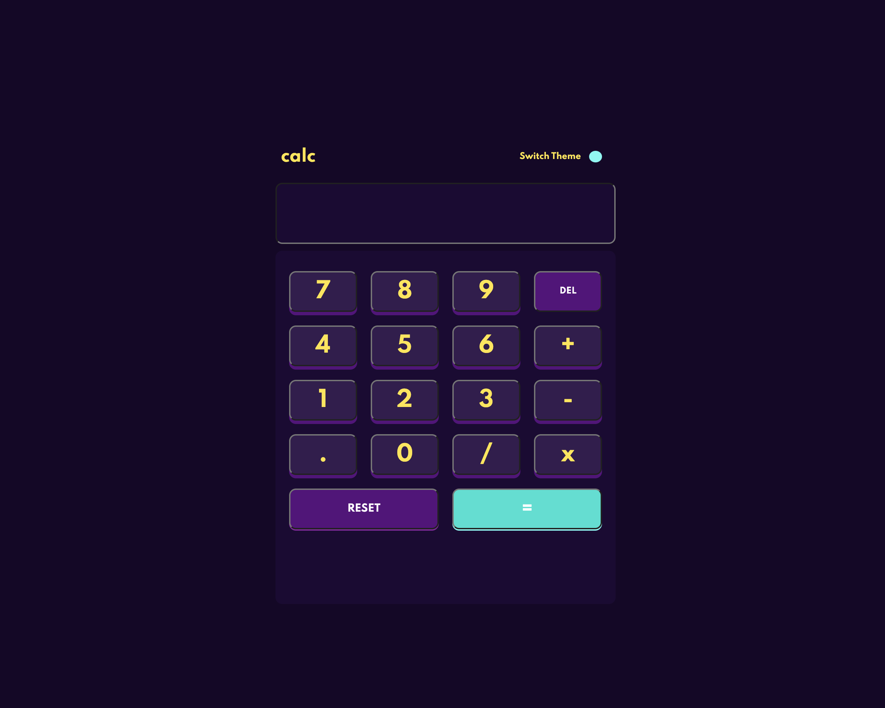

# Frontend Mentor - Calculator app solution

This is a solution to the [Calculator app challenge on Frontend Mentor](https://www.frontendmentor.io/challenges/calculator-app-9lteq5N29). Frontend Mentor challenges help you improve your coding skills by building realistic projects.

## Table of contents

- [Overview](#overview)
  - [The challenge](#the-challenge)
  - [Screenshot](#screenshot)
  - [Links](#links)
- [My process](#my-process)
  - [Built with](#built-with)
- [Author](#author)

## Overview

### The challenge

Users should be able to:

- See the size of the elements adjust based on their device's screen size
- Perform mathmatical operations like addition, subtraction, multiplication, and division
- Adjust the color theme based on their preference

### Screenshot

### Links

- Solution URL: [Github](https://github.com/whoiskekeanyway/theme-switching-calculator)
- Live Site URL: [theme-switching-calculator.netlify.app](theme-switching-calculator.netlify.app)

## My process

### Built with

- Semantic HTML5 markup
- CSS custom properties
- Flexbox
- CSS Grid
- Mobile-first workflow

## Author

- Website - [scriptsandtags.com](https://scriptsandtags.com)
- Frontend Mentor - [@whoiskekeanyway](https://www.frontendmentor.io/profile/whoiskekeanyway)
- Twitter - [@scriptsandtags](https://www.twitter.com/scriptsandtags)
